# OzStrips User Guide

OzStrips is a plugin for vatSys that emulates a tower's electronic strips system. This guide covers how to use the OzStrips software interface and features effectively.

---

## 📋 Table of Contents

- [Installation](#installation)
- [Getting Started](#getting-started)
- [Interface Overview](#interface-overview)
- [Working with Strips](#working-with-strips)
- [Keyboard Shortcuts](#keyboard-shortcuts)
- [Customization](#customization)
- [Troubleshooting](#troubleshooting)
- [Quick Reference](#quick-reference)

---

## 🚀 Installation

### Installing OzStrips
The OzStrips plugin is included by default in the Australia and Pacific vatSys profiles provided by VATPAC. Alternatively, it can be downloaded using the [vatSys Plugin Manager](https://github.com/badvectors/PluginManager).

If the client is installed correctly, there will be an **OzStrips** option in the Window dropdown menu.

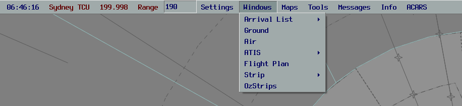

*OzStrips option in the vatSys Window dropdown menu*

---

## 🎯 Getting Started

### Connecting to an Aerodrome
1. Open vatSys and connect to VATSIM
2. Go to **Window** → **OzStrips** in the vatSys menu
3. Select your aerodrome from the dropdown menu or type the ICAO code
4. Wait for the connection status to turn green

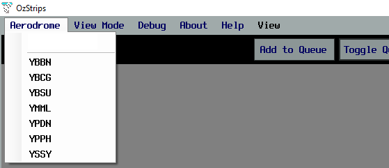

*Select your aerodrome from the dropdown menu*

> **Tip**: Pressing `[` and `]` will cycle through the aerodromes in the dropdown menu, allowing controllers to provide top-down coverage to multiple locations easily.

### Configuring Your View

#### View Mode Selection
Once connected to the relevant aerodrome, select the view mode which is most suitable for your position. Use the **View Mode** menu item to select a layout.

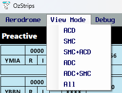

*Select the appropriate view mode for your controller position*

#### Layout Options
OzStrips offers different layout options to suit your needs:

**Narrow Layout (Single Column)**
The plugin window will adjust to being resized, automatically collapsing into a two and single column layout, which is helpful for users with small screens.

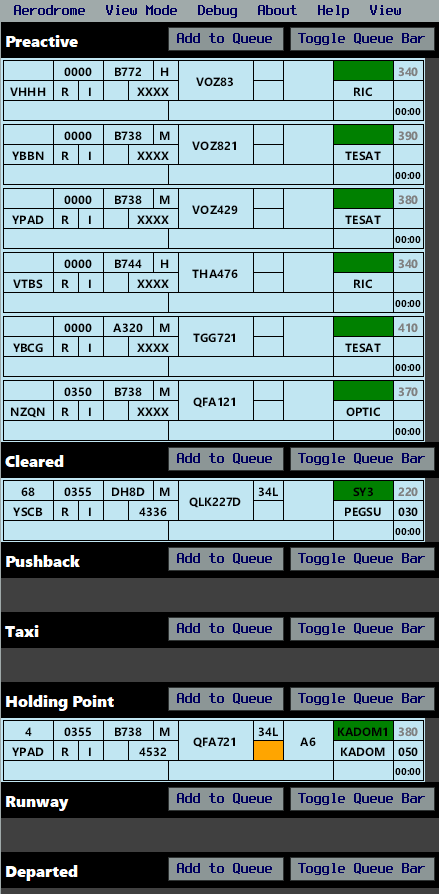

*Single column layout for compact displays*

**Smart Resize Setting**
By default, the height of each strip bay is fixed, however using the **Smart Resize** functionality, they can be set to a dynamic height based on the number of strips in each bay. This is helpful when using the plugin in a collapsed column layout or with limited screen height.

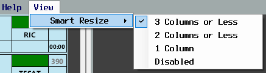

*Enable smart resize for automatic layout adjustment*

---

## 📋 Working with Strips

### Strip Basics

The background colour of the strip corresponds to its status as an arrival or a departure. **Departing** aircraft have a blue strip, **arriving** aircraft have a yellow strip, and **local** aircraft have a pink strip.

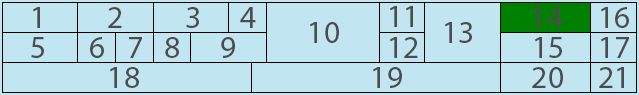

*Basic strip showing flight information*

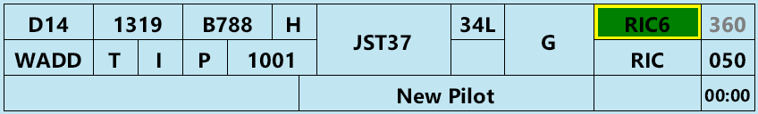

*Example strip with filled information showing current state*

### Strip Components

Each strip contains multiple fields that can be interacted with:

| Number | Content | Left Click | Right Click | Possible Alert / Alarm |
|--------|---------|------------|-------------|----------------------|
| **1** | **Bay Number** | Edit Bay Number | | |
| **2** | **Filed Off Blocks Time** | Cock Strip | | |
| **3** | **Aircraft Type** | Open Flightplan | | |
| **4** | **Wake Turbulence Category** | | | |
| **5** | **Destination** | Open Flightplan | | |
| **6** | **Voice Receive Capability Indicator** | Show Route | | |
| **7** | **Flight Rules** | Show Route | | |
| **8** | **PDC Indicator** | Open PDC Window | Open PM Window | |
| **9** | **SSR Code** | Autogenerate Code | | Incorrect SSR Code or Mode |
| **10** | **Callsign** | Select Strip | | Worldflight Team |
| **11** | **Runway** | Change Runway | | |
| **12** | **Ready Flag** | Toggle Ready Flag | | Aircraft in Holding Point / Runway bay but not ready |
| **13** | **Holding Point** | Edit Holding Point | | |
| **14** | **SID** | Move strip to next bay | Change SID | SID Transition Exists or VFR Aircraft issued a SID |
| **15** | **First Waypoint** | Open flightplan | Open Reroute Window | Potentially Incorrect Routing |
| **16** | **Requested Level** | Open flightplan | | |
| **17** | **Cleared Level** | Change CFL | | Incorrect Cruising Level |
| **18** | **vatSys Global Ops Field** | Edit | | |
| **19** | **OzStrips Remarks** | Edit | | |
| **20** | **Departure Heading** | Edit Departure Heading | | No HDG input to Radar SID Departures |
| **21** | **Takeoff Timer** | Start / Reset | | |

> **Note**: SID triggering won't automatically move strips into the runway bay - this must be done manually to prevent accidental runway placement.

### Moving Strips

Strips can be moved in between strip bays by clicking on their callsign, and clicking the bay where you want them to go. Strips can be moved to the next bay by clicking on the SID box (referred to as **SID triggering**).

> **Note**: Strips can not be SID triggered from the **Holding Point Bay** to the **Runway Bay**, to prevent accidental placement onto the runway.

### Strip Colors and States

#### Strip Colors
| Color | Aircraft Type |
|-------|---------------|
| **Blue** | Departure aircraft |
| **Yellow** | Arrival aircraft |
| **Pink** | Local aircraft (circuits) |

#### Strip States
| State | Description |
|-------|-------------|
| **Preactive** | Aircraft filed flight plan, not yet cleared |
| **Cleared** | Aircraft has clearance, ready for pushback |
| **Pushback** | Aircraft requesting/approved for pushback |
| **Holding Point** | Aircraft at holding point, ready for taxi |
| **Runway** | Aircraft on runway, ready for takeoff |
| **Departures** | Aircraft airborne, handed off to departures |

### Workflow Examples

#### ACD (Aerodrome Control) Workflow
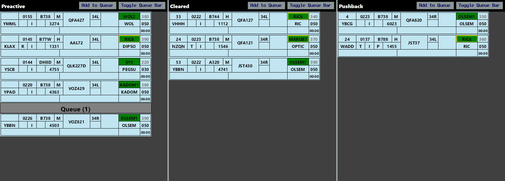

*Typical workflow for aerodrome control operations*

#### ADC (Approach Departure Control) Workflow  
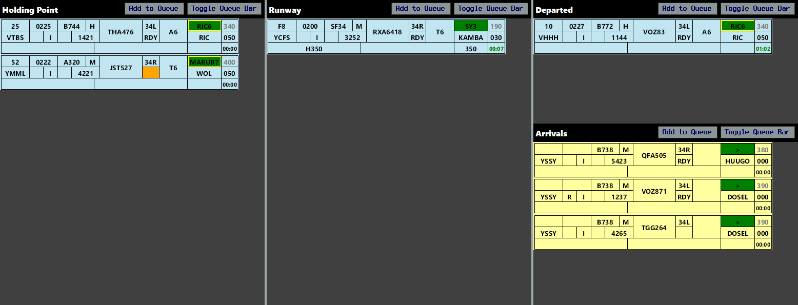

*Workflow for approach and departure control*

#### SMC (Surface Movement Control) Workflow
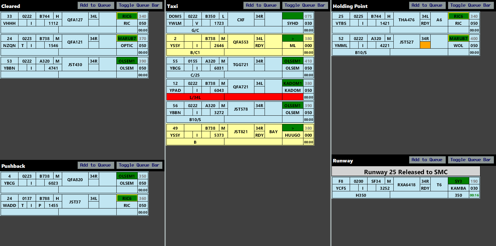

*Surface movement control workflow*

### Error Examples

#### Bad Level Assignment
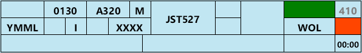

*Example of incorrect level assignment*

#### Bad Route Assignment
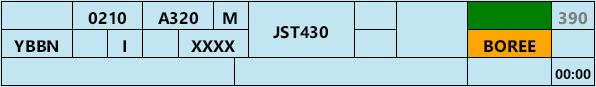

*Example of incorrect route assignment*

#### VFR SID Issues
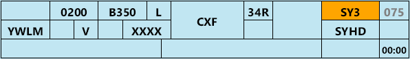

*Common VFR SID assignment errors*

### Local Flights
Pink local strips denote aircraft whose planned operation remains entirely on the ADC frequency (they will not be passed to Departures or leave ADC's jurisdiction).

---

## ⚙️ Customization

### Strip Scale
The size of each strip can be adjusted using the **Strip Scale** slider, under **Help** > **Settings**. Users with limited screen real estate may benefit from using a smaller strip size.

### Smart Resize
By default, the height of each strip bay is fixed, however using the **Smart Resize** functionality, they can be set to a dynamic height based on the number of strips in each bay. This is helpful when using the plugin in a collapsed column layout or with limited screen height.

### Custom Bars
The **ADD BAR** button allows controllers to place a variety of fixed bars anywhere on the stripboard, reflecting status changes and allowing additional queues to be built.

### View Modes

OzStrips offers different view modes to suit your needs:

#### Single Column Layout
For users with limited screen space, OzStrips can collapse into a single column layout.

#### Smart Resize
By default, strip bays have a fixed height. With Smart Resize enabled, bay heights adjust dynamically based on the number of strips in each bay.

---

## 🔧 Basic Features

### Strip Interaction
Each strip field can be interacted with using left and right mouse clicks:

| Field | Left Click | Right Click |
|-------|------------|-------------|
| **Bay Number** | Edit Bay Number | |
| **Aircraft Type** | Open Flightplan | |
| **Destination** | Open Flightplan | |
| **Callsign** | Select Strip | |
| **Runway** | Edit Runway | |
| **SID** | Edit SID | |
| **CFL** | Edit CFL | |
| **Remarks** | Edit Remarks | |

### Strip Movement
- **Click callsign** to select (pick) the strip, then **click destination bay** to drop
- **Click SID box** to trigger strip to next bay (SID triggering)
- **Use keyboard shortcuts** for quick navigation

> **Note**: It's recommended to use **SID triggering** rather than pick-and-drop, as misclicks can lead to strips going into bays they shouldn't be in.

### Strip Colors
- **Blue strips** = Departure aircraft
- **Yellow strips** = Arrival aircraft  
- **Pink strips** = Local aircraft (circuits)

### Strip Field Functions

Each strip field has specific functions you can access:

#### Assigned Heading
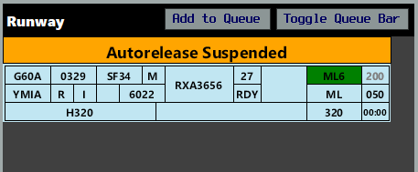

*Setting assigned headings for aircraft*

#### Radar SID
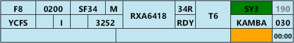

*Radar SID assignment interface*

#### SID Transition
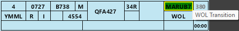

*SID transition management*

#### Squawk Code Assignment
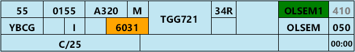

*Squawk code assignment interface*

#### Coordinator Interface
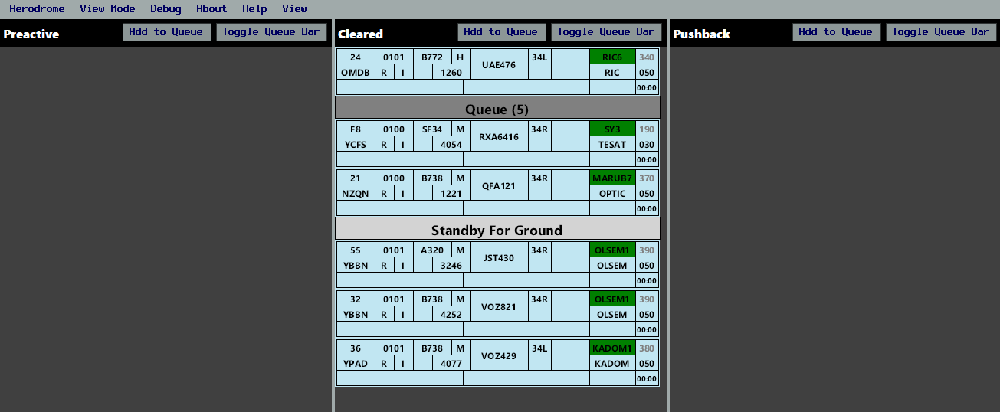

*Coordinator interface for multi-position operations*

---

## 📊 Workflow Examples

### ACD (Aerodrome Control) Workflow

*Typical workflow for aerodrome control operations*

### ADC (Approach Departure Control) Workflow  

*Workflow for approach and departure control*

### SMC (Surface Movement Control) Workflow

*Surface movement control workflow*

---

## ⚠️ Common Errors

### Bad Level Assignment

*Example of incorrect level assignment*

### Bad Route Assignment

*Example of incorrect route assignment*

### VFR SID Issues

*Common VFR SID assignment errors*

---

## 🖥️ Interface Overview

### Main Window Layout

The OzStrips interface is organized into a grid layout with multiple panels:

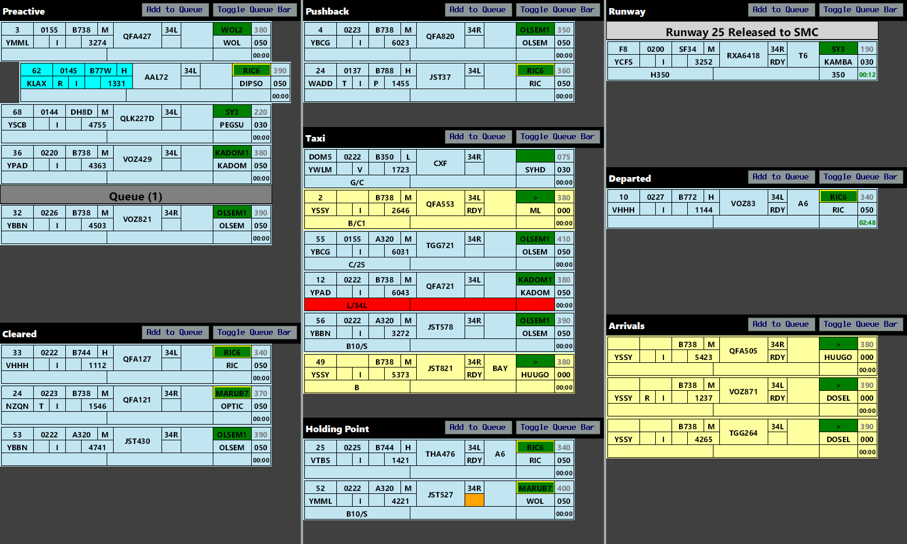

*Main OzStrips interface showing the stripboard layout*

The stripboard is divided into multiple bays, each representing a stage in an aircraft's flight thread.

### Control Bar

The bottom of the window holds the Control Bar. This panel contains the server connection status, aerodrome selected and ATIS code, among other elements.

Each button has the following function:

| Button | Function |
|--------|----------|
| **INHIBIT** | Hides a strip from the stripboard (used when a strip is no longer needed) |
| **XX CROSS XX** | Adds a red highlight to the selected strip, denoting an intention to cross a runway |
| **ADD BAR** | Allows controllers to place a variety of fixed bars anywhere on the stripboard, reflecting status changes and allowing additional queues to be built |
| **FLIP FLOP** | Toggles the selected strip between Departure, Arrival & Local states |

### Missing Strips

Selecting a track on the Ground Radar or ASD will select the relevant strip in OzStrips, and vice versa. If a strip is missing from the stripboard, select the ground track from the vatSys Ground window, then click the desired OzStrips bay to place the strip there.

---

## 🔧 Troubleshooting

### Connection Issues
**Problem**: CONN STAT shows red

**Solutions**:
- Wait 10 seconds for connection to establish
- Check internet connection
- Restart OzStrips and vatSys

### Missing Strips
**Problem**: Aircraft not appearing in OzStrips

**Solutions**:
- Click aircraft in vatSys and press **FOR STP**
- Check that ADEP or ADES matches your aerodrome
- Ensure aircraft has filed a flight plan

### Wrong Strip Type
**Problem**: Arrival aircraft showing as departure (or vice versa)

**Solutions**:
- Select strip and press **F** to flip-flop type
- Check aircraft's filed route

### Strip in Wrong Bay
**Problem**: Strip moved to incorrect bay

**Solutions**:
- Use **SID** button instead of drag-and-drop
- Select strip and use arrow keys to move
- Use **Backspace** to remove, then **FOR STP** to restore

### Integration Issues
**Problem**: Changes not appearing in vatSys

**Solutions**:
- Ensure strip is coordinated (blue in vatSys)
- Check that you're using latest version
- Restart both applications

### Performance Issues
**Problem**: OzStrips running slowly

**Solutions**:
- Close unnecessary vatSys windows
- Restart OzStrips
- Check system resources

---

## ⌨️ Keyboard Shortcuts

| Key | Action | When to Use |
|-----|--------|-------------|
| **Up** | Move strip vertically up | Reordering strips in same bay |
| **Down** | Move strip vertically down | Reordering strips in same bay |
| **Ctrl + Up** | Move to next bar | Quick bay transitions |
| **Ctrl + Down** | Move to previous bar | Quick bay transitions |
| **Space** | Add to queue | Aircraft waiting for clearance |
| **Tab** | Cock strip | Mark aircraft as ready |
| **X** | Mark as crossing | Aircraft crossing runway |
| **Alt + X** | Create crossing bar | Visual reminder for runway crossing |
| **F** | Flip-flop strip type | Switch between Arrival/Departure/Local |
| **Backspace** | Remove strip/bar | Hide strip or delete custom bar |
| **Enter** | SID trigger | Move strip to next bay |
| **[** | Previous aerodrome | Switch between airports |
| **]** | Next aerodrome | Switch between airports |

---

## 📖 Quick Reference

### Essential Keyboard Shortcuts
- **Enter**: SID trigger (move to next bay)
- **Tab**: Cock strip (mark as ready)
- **F**: Flip-flop strip type
- **X**: Mark as crossing
- **Backspace**: Remove strip/bar

### Strip Colors
- **Blue**: Departure aircraft
- **Yellow**: Arrival aircraft
- **Pink**: Local aircraft

### Recommended Workflow
1. Use **SID triggering** for standard progression
2. Use **pick-and-drop** only when necessary
3. Use **keyboard shortcuts** for efficiency
4. Monitor **alerts and warnings** on strips

### Getting Help
- Check the [VATPAC OzStrips Guide](https://sops.vatpac.org/client/towerstrips/) for operational procedures
- Review the [Reference Documentation](../reference/) for detailed information
- Contact the development team for technical issues

---

*For additional help, visit the [OzStrips Documentation](https://maxrumsey.xyz/OzStrips/) or the [VATPAC OzStrips Guide](https://sops.vatpac.org/client/towerstrips/).* 