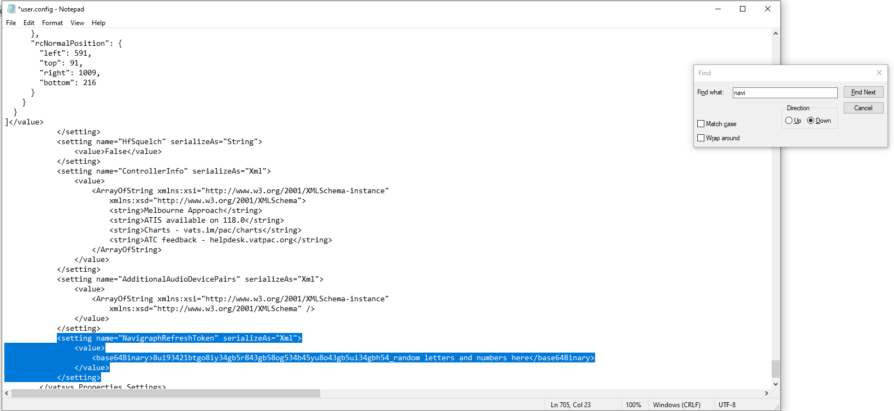

# FAQ
## Why does my server connection never establish?
Make sure you have selected your aerodrome in OzStrips, and you are connected in vatSys. A connection will never establish without a primed aerodrome.
<figure markdown="span">
  
</figure>

If a connection never establishes, this is due to a bug associated with downloading Nav Data from Navigraph in vatSys. To resolve this, unlink your Navigraph account from vatSys as so:
<figure markdown="span">
  
</figure>

You will need to restart vatSys.

As a VATPAC member, there is no requirement to retrieve Nav Data from Navigraph, as this is handled by the ATS team.

It takes roughly 10 seconds to connect, as OzStrips waits for vatSys to have downloaded all of it's Flight Plans.

### Manual Method
If a connection still fails to establish, you may manually need to remove the Navigraph connection string from your vatSys properties.

1. Close vatSys.
2. Search `%appdata%` in the Windows search bar.
3. Click `AppData` in the navigation bar.
4. Go to the `Local`, then `Sawbe.com` folder.
5. Click on the folder named `vatSys.exe_Url_<random_text>`, then the folder named similarly to `0.4.8114.34539`.
6. Open `user.config` in Notepad.
7. Press Ctrl+F and search for `Navigraph`, delete the highlighted text: 

8. Save the file and reopen vatSys.

If this still doesn't work, contact `ExiFlame` on Discord, or create a GitHub issue.

## How do I order strips vertically?
Click on the aircraft's callsign and press your arrow keys.

## What do the FOR STP and INHI buttons do?
Select an aircraft's strip **in vatSYS**, and press FOR STP, the aircraft's strip will appear in your top left bay, provided the aircraft is going to or from your aerodrome, and is within a suitable range. 

Pick an aircraft's strip **in OzStrips** and press INHI, the strip will disappear. To get the strip back, follow the steps above.

## When will the strip become Coordinated / Blue in vatSYS?
When you activate the Take Off Timer, or move the strip into the Pushback bay.

*Note: You can not change the aircraft's CFL, SID, or RWY at this point.*

## How do I open the vatSYS Flight Plan Window?
Click on the aircraft's destination.

## What should I do with aircraft doing circuits?
If they haven't created a flight plan, create a flight plan for them, so that they will have a squawk code. They should appear in your Arrivals or Preactive bay, but if they don't, click on their **vatSys strip** and press "FOR STP" in OzStrips. If they still don't appear, check to make sure that either the ADES or ADEP airport is your selected airport.

## Another aerodrome controller is not using OzStrips, what should I do?
If a position (SMC, ADC or ACD) is not using OzStrips, you will need to ensure your current view includes theirs. 

If SMC is not using OzStrips, ADC should ensure they select the `ADC+SMC` view.

If ACD is not using OzStrips, SMC should select the `ACD + SMC` view.

Keep in mind no controller is required to use OzStrips if they are not familiar, or just don't want to. If a controller not using OzStrips is causing more work then OzStrips saves, consider not using OzStrips yourself, and focus instead on providing a quality service!