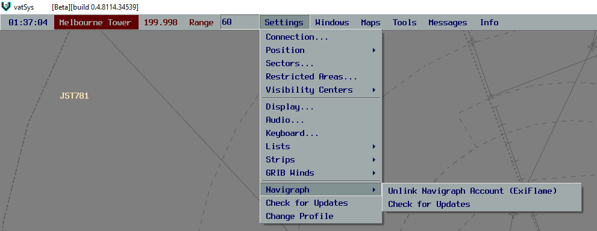
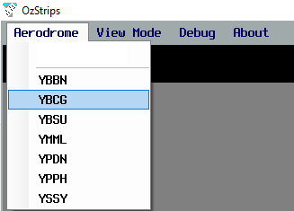

# FAQ
## Why does my server connection never establish?
This is due to a bug associated with downloading Nav Data from Navigraph in vatSys. To resolve this, unlink your Navigraph account from vatSys as so:
<figure markdown="span">
  
</figure>

If this still doesn't work, make sure you have selected your aerodrome in OzStrips.
<figure markdown="span">
  
</figure>

It takes roughly 10 seconds to connect, as OzStrips waits for vatSys to have downloaded all of it's Flight Plans.

If this still doesn't work, contact `ExiFlame` on Discord, or create a GitHub issue.

## How do I order strips vertically?
Click on the aircraft's callsign and press your arrow keys.

## What do the FOR STP and INHI buttons do?
Select an aircraft's strip **in vatSYS**, and press FOR STP, the aircraft's strip will appear in your top left bay, provided the aircraft is going to or from your aerodrome, and is within a suitable range. 

Pick an aircraft's strip **in OzStrips** and press INHI, the strip will disappear. To get the strip back, follow the steps above.

## When will the strip become Coordinated / Blue in vatSYS?
When you activate the Take Off Timer, or move the strip into the Pushback bay.

*Note: You can not change the aircraft's CFL, SID, or RWY at this point.*

## How do I open the vatSYS Flight Plan Window?
Click on the aircraft's destination.