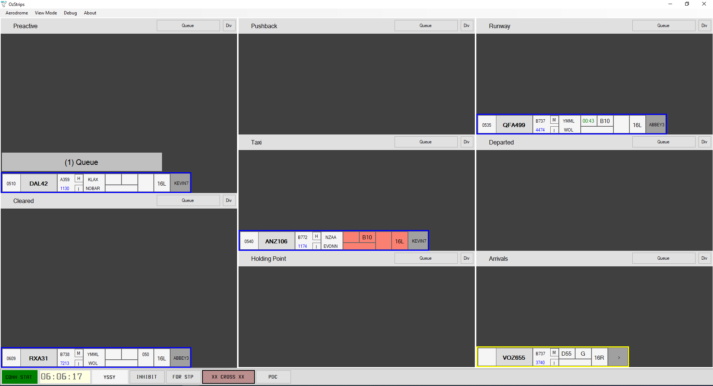

OzStrips is a plugin for vatSys, that emulates a tower's electronic strips system.

At its core, it provides an easy to use and intuitive user interface; supporting controlling a single aerodrome position, to providing top-down control to all positions.   

---

## Features
### Shared state
Changes made to your strips or layout will be replicated to other controllers using OzStrips. 

This allows greater situational awareness of aerodrome operations when operating with SMC, ADC and ACD split. Reliably project future workload and ease coordination.

In case of disconnection, your layout and aircraft data is automatically synced, allowing you to hit the ground running.
### Workload management

Easily "queue up" strips when aircraft request pushback, clearance or taxi. The position in queue can be readily gained, keeping pilots informed and ensuring no one is missed out.

### vatSys Integration
With one click, access an aircraft's Flight Plan Window, send a PDC or set the CFL.

Changes made to an aircraft's Runway, SID or CFL will automatically update the relevant vatSys Flight Data Record. HDG changes will be saved to the aircraft's Global Ops strip field, allowing easy access by Approach Controllers.
