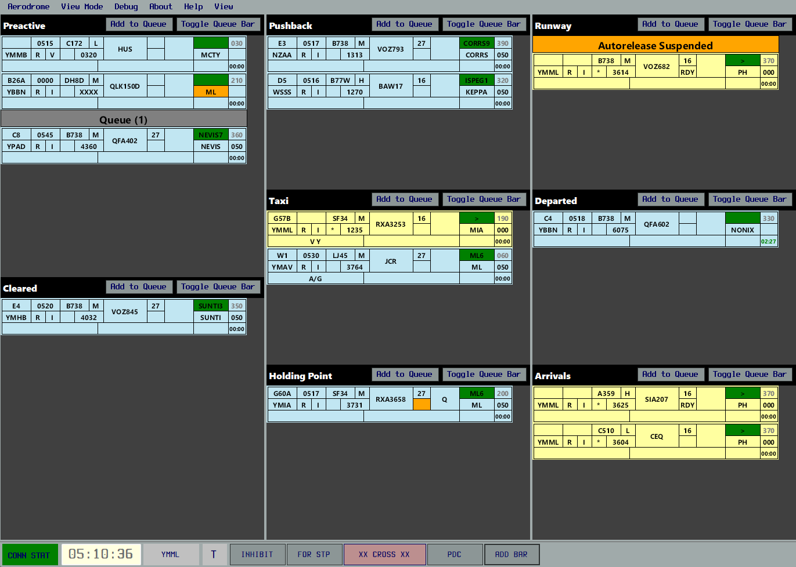

OzStrips is a plugin for vatSys, that emulates a tower's electronic strips system.

At its core, it provides an easy to use and intuitive user interface; supporting controlling a single aerodrome position, to providing top-down control to all positions.
It's design and use case centres around a controller providing top-down services to a single aerodrome; while multi-aerodrome use is possible, it is not necessarily supported.

---

## Features
### Shared state
Changes made to your strips or layout will be replicated to other controllers using OzStrips. 

This allows greater situational awareness of aerodrome operations when operating with SMC, ADC and ACD split. Reliably project future workload and ease coordination.

In case of disconnection, your layout and aircraft data is automatically synced, allowing you to hit the ground running.
### Workload Management
Easily "queue up" strips when aircraft request pushback, clearance or taxi. The position in queue can be readily gained, keeping pilots informed of expected delay, and ensuring no one is missed out.

### vatSys Integration
With one click, access an aircraft's Flight Plan Window, send a PDC or set the CFL.

Changes made to an aircraft's Runway, SID or CFL will automatically update the relevant vatSys Flight Data Record. HDG changes will be saved to the aircraft's Global Ops strip field, allowing easy access by Approach Controllers.

### Designed for Aerodrome Controllers First
While vatSys was designed and based off of Australia's enroute and approach ATS system Eurocat, OzStrips was loosely modelled off of INTAS. The plugin is designed to ease the workload of aerodrome level controllers, with automatic first waypoint detection, alerts for incorrect SSR Codes, cruising levels, and filed routes.

## Training
Connection as an OBS to test out the plugin is recommended, fully supported, and your changes will not have any effect on live operations.

If you are a member of the VATPAC Division, consider reading this guide in conjunction with their [OzStrips Guide](https://sops.vatpac.org/client/towerstrips/).