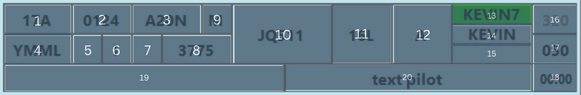

# Strip
<figure markdown="span">
  
  <figcaption>A departure strip</figcaption>
</figure>

## Strip Colours
Departure strips are blue, while arrival strips are yellow.

## Strip Posting
You will only see strips for aircraft that have requested planned an ADES or ADEP of your aerodrome. Aircraft doing circuit work at your aerodrome, but not arriving or departing there will not receive a strip.

## Strip Layout

| Element | Description | Click Action |
|---------|-------------|--------------|
| 1 | Bay Number | Change |
| 2 | Filed Off Blocks Time | Cock Strip |
| 3 | Aircraft Type | Open Flightplan |
| 4 | Destination | Open Flightplan |
| 5 | Unused | |
| 6 | Flight Rules | |
| 7 | Correct SSR Code + Mode C Received | |
| 8 | SSR Code | Generate Code |
| 9 | Wake Turbulence Category | |
| 10 | Callsign | Pick / Select Strip |
| 11| Runway | Change |
| 12 | Holding Point / Clearance Limit | Change |
| 13 | SID | Move strip to next bay \* |
| 14 | First Waypoint | Open flightplan |
| 15 | Departure Heading | Change |
| 16 | Requested Level | Open flightplan |
| 17 | Cleared Level | Change |
| 18 | Takeoff Timer | Start / Reset # |
| 19 | Global Ops Data ^ | Change |
| 20 | Local Remarks ^ | Change |

\* Won't automatically move bay into runway, this must be done manually.

\# Will also coordinate (activate, make blue) the strip if not already done via moving into Pushback or later bay.

^ Global Ops are visible to all controllers. Local Remarks are only visible to OzStrips users.
