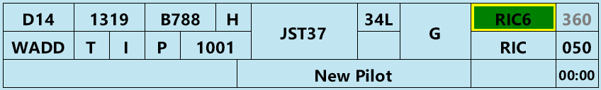
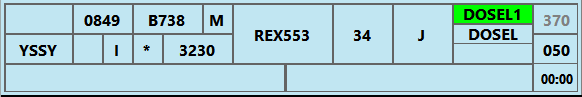
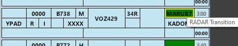

# Strip
<figure markdown="span">
  
  <figcaption>A departure strip</figcaption>
</figure>

## Strip Colours
Departure strips are blue, while arrival strips are yellow. Local strips, which are pink, are for aircraft conducting circuits. Aircraft that have planned to arrive and depart from your aerodrome (by their ADEP and ADES) can be toggled between Departure, Local and Arrival strips. This is triggered using the flip-flop button in the Control Bar, or by designating (picking) the strip and pressing "F".

## Strip Posting
You will only see strips for aircraft that have requested planned an ADES or ADEP of your aerodrome. Aircraft doing circuit work at your aerodrome, but not arriving or departing there will not have a strip.

## Strip Layout

| Number | Content | Left Click | Right Click | Possible Alert / Alarm |
|---------|-------------|--------------| ----------- | -- |
| **1** | **Bay Number** | Edit Bay Number | |
| **2** | **EOBT or CDM Time** | Cock Strip | Open CDM info window |
| **3** | **Aircraft Type** | Open Flightplan | |
| **4** | **Wake Turbulence Category** | | |
| **5** | **Destination** | Open Flightplan | |
| **6** | **Voice Receive Capability Indicator** | Show Route | |
| **7** | **Flight Rules** | Show Route | |
| **8** | **PDC Indicator** | Open PDC Window | Open PM Window | |
| **9** | **SSR Code** | Autogenerate Code | | Incorrect SSR Code or Mode |
| **10** | **Callsign** | Select Strip | | Worldflight Team |
| **11** | **Runway** | Change Runway | |
| **12** | **Ready Flag** | Toggle Ready Flag | | Aircraft in Holding Point / Runway bay but not ready |
| **13** | **Holding Point** | Edit Holding Point | |
| **14** | **SID** \* | Move strip to next bay | Change SID | (Yellow Outline) SID Transition Exists or (Orange Background) VFR Aircraft issued a SID |
| **15** | **First Waypoint** | Open flightplan | Open Reroute Window | Potentially Incorrect Routing |
| **16** | **Requested Level** | Open flightplan | |
| **17** | **Cleared Level** | Change CFL | | Incorrect Cruising Level |
| **18** | **vatSys Global Ops Field** ^ | Edit | |
| **19** | **OzStrips Remarks** ^ | Edit | |
| **20** | **Departure Heading** | Edit Departure Heading | | No HDG input to Radar SID Departures |
| **21** | **Takeoff Timer** \# | Start / Reset | |

\* Won't automatically move bay into runway, this must be done manually.

\# Will also coordinate (activate, make blue) the strip if not already done via moving into Pushback or later bay.

^ Global Ops are visible to all controllers. Local Remarks are only visible to OzStrips users.

## Alerts
### Non-standard Cruising Altitude
Indicates a pilot had filed a level that is non-compliant with the table of standard cruising levels per the Australian AIP.

### Non-compliant Route Filed
Indicates a pilot has filed a route that is contrary to the list of routes in the Australian ERSA Flight Planning Requirements document.

It is at the controller's discretion whether or not the aircraft is recleared along a new route. Take into account possible workload and loss of strategic separation due to the non-compliant route, effect on TCU operations and ability of the pilot to reenter a new route.

### Aircraft not Ready
An aircraft is in the Holding Point or Runway bay without reporting ready.

### VFR Aircraft Issued a SID
A VFR aircraft has been issued a SID.

### SID Transition Exists
This SID has a transition.

### WorldFlight Team
This pilot is an official WorldFlight team. (Only visible during WorldFlight mode).

### Incorrect SSR Code or Mode
An aircraft has commenced taxiing, without squawking Mode C and the correct code. (Exception exists for A388s, where they will only alert if not squawking the correct code).

### HDG not Assigned to Radar SID
An aircraft departing on a RADAR SID does not have a heading issued, in the Holding Point or Runway Bay.
