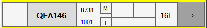
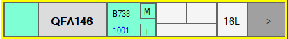
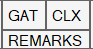
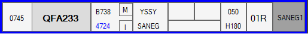
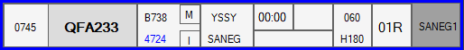
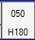

# Strips
The strip contains relevant information for an aircraft. Each aircraft will have one strip only. Inbound (arrival) strips will display in a yellow holder, outbound (departure) strips will have a blue outline.

## Arrival Strip
<figure markdown="span">
  
  <figcaption>Arrival Strip</figcaption>
</figure>
From left-to-right:

### Strip Cock Button
Press this field to "cock" the strip, and change the selector colour from white -> cyan -> pink.
<figure markdown="span">
  
  <figcaption>A cocked arrival strip</figcaption>
</figure>

### Callsign
Left click this field to pick the aircraft. When picked, the Callsign field will darken. Picking allows you to manually drop the aircraft into different bays, send a PDC or "queue up" the aircraft.

### Aircraft Information
This field contains the aircraft type code, wake turbulence category, flight rules and squawk code (in blue).

### CLX, Gate and Remarks Field
Left click this field to edit these fields.
<figure markdown="span">
  
  <figcaption>Gate, CLX and Remarks Field</figcaption>
</figure>

### Runway Field
This displays the assigned runway.

### SID Trigger Button
Press this button to move the strip into the next phase (Runway -> Taxi -> Strip is hidden).

---

## Departure Strip
<figure markdown="span">
  
  <figcaption>ACD and SMC Strip</figcaption>
</figure>
<figure markdown="span">
  
  <figcaption>ADC Strip</figcaption>
</figure>
From left-to-right:

### ETD Field
This strip contains the filed Estimated Time of Departure. Press this field to "cock" the strip, and change the selector colour from white -> cyan -> pink.

### Callsign
Left click this field to pick the aircraft. When picked, the Callsign field will darken. Picking allows you to manually drop the aircraft into different bays, send a PDC or "queue up" the aircraft.

### Aircraft Information
This field contains the aircraft type code, wake turbulence category, flight rules and squawk code (in blue). Click the squawk code to assign it, if it is "XXXX".

### Destination and First Waypoint Field
This field contains the destination and first waypoint / SID transition, as you'd read it out when giving a clearance. 

Left click this field to open the vatSYS Flight Plan Window for an aircraft.

### CLX, Gate and Remarks Field
Left click this field to edit these fields.
<figure markdown="span">
  
  <figcaption>Gate, CLX and Remarks Field</figcaption>
</figure>

### Takeoff Timer
In ADC strips, instead of a GATE field, this contains a takeoff timer. Left click to begin the timer.

### CFL and Heading Field
Left click this field to edit these fields, as well as assigned runway and SID.
<figure markdown="span">
  
  <figcaption>CFL and Heading Field</figcaption>
</figure>

### Runway Field
This displays the assigned runway.

### SID Field
Contains the assigned SID. Press this button to move the strip into the next phase. You can not SID trigger into a runway bay, you need to manually pick and drop this. You can SID trigger from the runway bay to the departures bay however.
