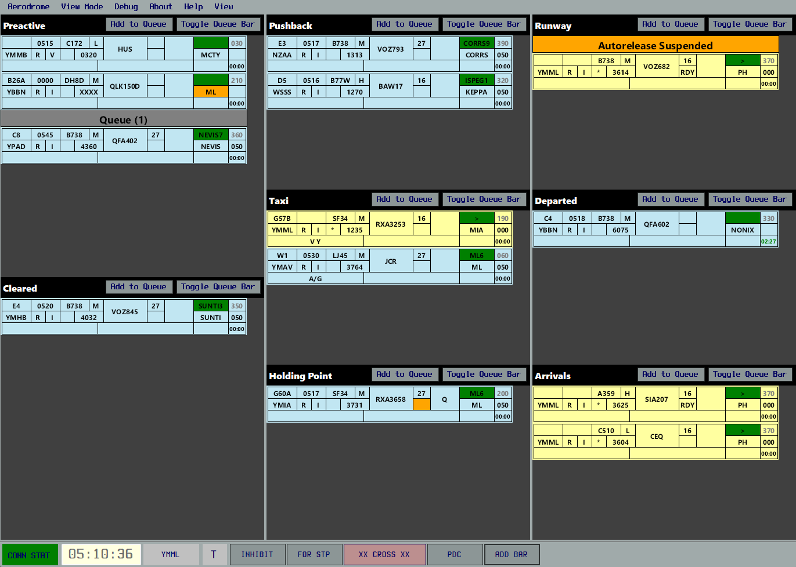

# Window

## Menu Bar
### Aerodrome
Set the Aerodrome by clicking on one of the options, or enter the 4 character ICAO code in the text field. 
### View Mode
Select the relevant view mode. If operating top-down, select "All". If one aerodrome is not using OzStrips, select the view mode that also encompasses their position. 
#### Example
If ADC, SMC and ACD are online, but the ACD is not using OzStrips, the SMC would select "SMC+ACD".
### Debug
The SignalR message log can be viewed here. You will not need to access this as part of regular use.
### About
View OzStrips information, including version number.
### View
Sets various view related options.

## Strip Bay
Each strip bay will display relevant strips. See [Stripbay](stripbay.md) for more information.

## Control Bar
Displayed at the bottom of the window, the control bar displays aerodrome information and quick commands.
### Connection Status
The "CONN STAT" box will change colour depending on connection status to the OzStrips server.
### Time
Displays the time in UTC / Zulu time.
### Aerodrome Name
Displays the aerodrome name.

Hover over this to see the aerodrome metar.
### Inhibit Button
With a strip picked, select this button to remove the strip from your stripboard.
### Cross Button
Pick a strip and press this button to add crossing highlights for situational awareness.
### Add Bar Button
Adds a custom menu bar.
### Flip-Flop
Flip-flops a strip with the same destination and departure aerodrome between Departure, Local and Arrival modes.